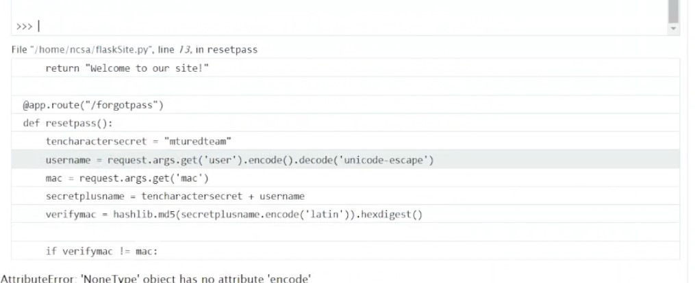

# Problem description

> Use a flaw in the forgot password page to get the admin password.<br>
> https://\<domain\>/forgotpass?user=\<name\>&mac=\<string of chars\>

---

## Writeup 작성자

- JHH20

---

## 첫 번째 시도

URL에서 `user=<name>` 부분을 `user=admin`으로 바꿔 브라우저로 접속하기

결과
> MAC does not match expected value

## 두 번째 시도

URL에서 모든 query를 제거 ('?' 뒤의 모든 부분)

결과
> 

진전이 있다!

다른 페이지를 찾을 수가 없으니까 앞으로의 시도는 이 페이지에서 이어서 함

## 세 번째 시도

페이지 탐색하기!
- Traceback을 누르면 에러의 callstack을 볼 수 있지만 쓸모 없음
- 보이는 python 코드에 마우스를 올리면 콘솔 아이콘이 뜸
  - 
  - 누르면 PIN을 입력하라는 팝업이 떠 접근이 제한된다
    > 

페이지 하단에 적힌 문구
> For code execution mouse-over the frame you want to debug and click on the console icon on the right side

혹시 저 팝업만 뚫으면 되지 않을까? (아닙니다)

#### 팝업을 뚫기 위한 뻘짓

> Chrome 브라우저 개발자 툴(Sources 탭)을 이용해 페이지 자바스크립트 소스 탐색
>
> 찾은 JS 파일: forgotpass?...&f=debugger.js
>
> Chrome에서 Source Override 기능을 사용해 페이지 스크립트 대신 로컬 버전을 사용하기
> > https://stackoverflow.com/a/49244113
> > 
>
> forgotpass 자바스크립트에서 PIN을 요청하거나 접근을 제한하는 코드를 전부 주석 처리함
>
> 자바스크립트 주석 처리 이후 페이지 새로고침하고 콘솔 열기
> > 
> > 이제 python 코드 자유롭게 사용 가능...이라 생각했다
>
> 현재 페이지가 콘솔 안에서 다시 보임. 이후 코드는 HTTP 503 에러
> > 
> > 

## 네 번째 시도

세 번째 시도를 하던 와중에 실수로 callstack에 있는 파일 경로를 클릭함
> 

파일 경로를 클릭하면 보이는 코드 1줄에 근접한 코드를 다 보여줌
> 

어떻게 하면 admin으로 접속하는 방법을 알 수 있게 됨

> `/forgotpass?user=admin&mac=<usermac>`으로 접속했다고 가정하면...<br>
> "mturedteamadmin".encode('latin')의 md5 해쉬값을 16진수로 나타낸 값이 `<usermac>`과 같으면 admin이 되어 플래그 획득!

<br><br>
아래의 코드를 python3로 실행해서 mac 값을 찾아 URL에 넣고 접속하기
```python
import hashlib
secret = "mturedteam"
text = secret + "admin"
sol = hashlib.md5(text.encode('latin')).hexdigest()
print(sol)
```

## 플래그

